<div style="text-align:center;font-size:30px">﷽</div>


# Environnement du travail

### Anaconda

[Anaconda](https://www.anaconda.com/) est un utilitaire pour **Python** offrant de nombreuse fonctionnalité. Il offre par exemple la possibilité d’**installer des librairies** et de les utiliser dans ses programmes, mais aussi propose des logiciels pour **aider les développeurs** a avoir un environnement de développement complet rapidement.

### Spyder

[Spyder](https://www.spyder-ide.org/) (nommé Pydee dans ses premières versions) est un **environnement de développement** pour **Python**. **Libre** (Licence MIT) et multi plateforme, il intègre de nombreuses bibliothèques d'usage scientifique **Matplotlib**, **NumPy**, **SciPy** et **IPython**.

### Scikit-learn

[Scikit-learn](https://scikit-learn.org/stable/) est une **bibliothèque** **libre** **Python** destinée à **l'apprentissage automatique**. Elle est développée par de nombreux contributeurs notamment dans le monde académique par des instituts français d'enseignement supérieur et de recherche comme Inria et Télécom Paris. Elle comprend notamment des fonctions pour estimer des forêts aléatoires, des régressions logistiques, des algorithmes de classification, et les machines à vecteurs de support. Elle est conçue pour s'harmoniser avec d'autres bibliothèques libres Python, notamment **NumPy** et **SciPy**.

### Matplotlib

[Matplotlib](https://matplotlib.org/) est une **bibliothèque** du langage de programmation **Python** destinée à **tracer et visualiser des données sous formes de graphiques**. Elle peut être combinée avec les bibliothèques python de calcul scientifique **NumPy** et **SciPy6**. *Matplotlib* est distribuée **librement** et **gratuitement** sous une licence de style BSD. Sa version stable actuelle (la 2.0.1 en 2017) est compatible avec la version 3 de Python.

---

# Étude

## Étude statistique

On va utiliser importer ces bibliothèques qui vont faciliter notre tache

```python
import pandas as pd
import matplotlib.pyplot as plt
```

### Étude Basic

Dans cette partie on va utiliser la data set `detailed-cases.csv` qui contient des données sur plus du **800** cas récupérer **entre 13/01/2020 et 09/02/2020** dans **China**, **Hong Kong**, **Japan**, **Singapore**, **South Korea** et d'autres pays.

```python
df = pd.read_csv('./datasets/detailed-cases.csv')
```

nous voulons d'abord estimer l'âge des personnes susceptibles d'être malades avec cette pandémie. Pour faire

```python
boxplot = df.boxplot(column=['age'])
```



On remarque donc que plus de 50% des infecté sont âgés entre 35 et 65 et que l'age moyen est de 53.  

On veut maintenant étudier l'effet du sexe sur la répartition des cas

+  par rapport aux nombres d'infections

```python
fig, ax = plt.subplots()
ax.boxplot([df.query('gender == "male"')['age'], df.query('gender == "female"')['age']])
ax.set_xticklabels(['male', 'female'])
```


Donc la distribution des infectées entre les deux sexe par rapport a l'age est pratiquement équitable. 

+  par rapport aux nombres de décès

```python
fig, ax = plt.subplots()
ax.boxplot([df.query('gender == "male" and death == "1"')['age'], df.query('gender == "female" and death == "1"')['age']])
ax.set_xticklabels(['male', 'female'])
```

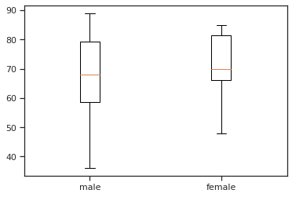

Donc par rapport  aux nombres de décès, plus de 50% des décès des hommes sont âgés entre 60 et 80. Cependant 50% des décès des femmes sont âgées entre 67 et 82.

+  Le pourcentage des décès

```python
df.death.groupby(df.death).count().plot(kind='pie')
plt.axis('equal')
plt.show()
```


On remarque que le pourcentage des décès est inférieur a 10%.

+  On veut maintenant étudier les symptômes, et pour faire on peut utiliser les nuages des mots.

```python
from wordcloud import WordCloud

separateur = ' '
df = df.fillna(value={'symptom': ''})
text = separateur.join(df['symptom'])
text = text.replace(",", "").strip()

word_cloud = WordCloud().generate(text)

image = word_cloud.to_image()
image.show()
```

 

Donc les symptômes qui apparaissent sur la plupart des infectés par COVID-19 sont : **Fièvre**, **Toux sèche**, **Dyspnée**, **Fatigue**, **Diarrhée**, **Malaise**, **Gorge irritée**.

### La tendance de l'évolution du la pandémie

Pour cette partie on va utiliser la data set qui existe dans ce [repo-Github](https://github.com/datasets/covid-19) qui contient les données de l’évolution cumulé globale du COVID-19 (`worldwide-aggregated.csv`), l’évolution cumulé dans chaque pays (`countries-aggregated.csv`), une comparaison entres les pays les plus touchées par cette pandémie (`key-countries-pivoted.csv`) et des détailles par rapport aux états unis (`us_confirmed.csv` et `us_deaths.csv`) - on va pas étudier le cas des états unis -

+  L’évolution du nombre de cas globalement

On va utiliser la data set `worldwide-aggregated.csv`

```python
df = pd.read_csv('./datasets/worldwide-aggregated.csv')
```

pour l’évolution du nombre de cas suspect, des décès et des cas rétablis

```python
ax = plt.gca()

df.plot(kind='line',x='Date',y='Confirmed',ax=ax)
df.plot(kind='line',x='Date',y='Recovered', color='red', ax=ax)
df.plot(kind='line',x='Date',y='Deaths', color='green', ax=ax)

plt.title('Total cases')
plt.xticks(rotation=45)

plt.show()
```

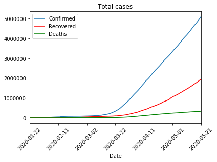

+  Le taux d'augmentation du nombre de cas chaque jours

```python
ax = plt.gca()

df.plot(kind='line',x='Date',y='Increase rate',ax=ax)

plt.title("Le taux de d'augmantation")
plt.xticks(rotation=45)

plt.show()
```

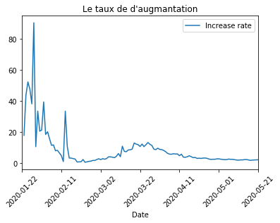

+  On veut maintenant comparer l’évolution de la pandémie dans les 8 premiers pays dans le nombre de cas

```python
df = pd.read_csv('./datasets/key-countries-pivoted.csv')

fig, ax_lst = plt.subplots(4, 2, sharex='col', sharey='row')

for i in range(1, 9):
    ax = ax_lst.ravel()[i-1]
    ax.xaxis.get_major_locator().set_params(nbins=3)
    ax.yaxis.get_major_locator().set_params(nbins=2)
    df.plot(kind='line',x='Date',y=df.columns[i],ax=ax)

fig.tight_layout(pad=0, h_pad=.1, w_pad=.1)
```

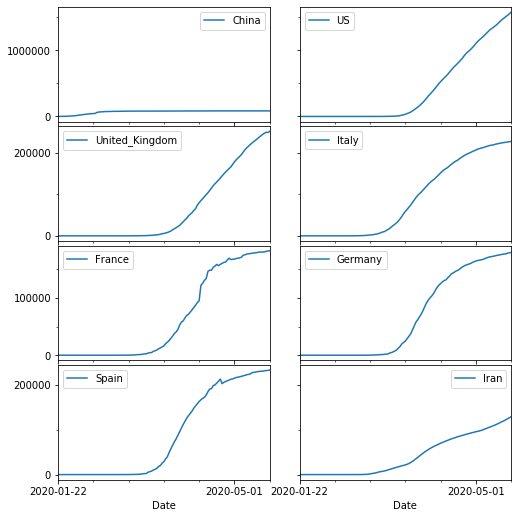

+  Une comparaison entre les 5 continents

```python
continents = ['Africa', 'South America', 'Europe', 'North America', 'Asia']
df = pd.read_csv('./datasets/continents-cases-deaths.csv')

fig, ax_lst = plt.subplots(3,2 , figsize=(8, 7), sharex='col', sharey='row')
fig.delaxes(ax_lst[2,1])

for i in range(5):
    ax = ax_lst.ravel()[i]
    ax.xaxis.get_major_locator().set_params(nbins=3)
    ax.yaxis.get_major_locator().set_params(nbins=2)
    ax.title.set_text(continents[i])
    df.query('Entity == "' + continents[i] + '"').plot(kind='line',x='Date',y='Total confirmed deaths (deaths)', color='red', ax=ax)
    df.query('Entity == "' + continents[i] + '"').plot(kind='line',x='Date',y='Total confirmed cases (cases)', color='blue', ax=ax)    

fig.tight_layout(pad=0, h_pad=.1, w_pad=.1)
fig.show()
```

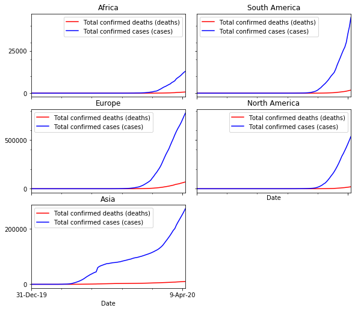

### L’évolution en Algérie

+  L’évolution du nombre cumulé de cas confirmés, décès et rétablis

```python
df = pd.read_csv('./datasets/countries-aggregated.csv')
df['Date'] = pd.to_datetime(df['Date'])

ax = plt.gca()
df_algeria = df.query('Country == "Algeria"')
df_algeria.loc[df_algeria['Date'] > '2020-02-15'].plot(kind='line',x='Date',y='Confirmed',ax=ax)
df_algeria.loc[df_algeria['Date'] > '2020-02-15'].plot(kind='line',x='Date',y='Recovered', color='green', ax=ax)
df_algeria.loc[df_algeria['Date'] > '2020-02-15'].plot(kind='line',x='Date',y='Deaths', color='red', ax=ax)
plt.title('Total cases')
plt.xticks(rotation=45)
plt.show()
```

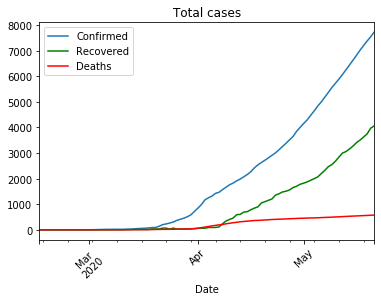

+  L’évolution du nombre de cas confirmés, décès et rétablis par jour

```python
df = pd.read_csv('./datasets/COVID-19-geographic-disbtribution-worldwide.csv')
df['dateRep'] = pd.to_datetime(df['dateRep'], dayfirst=True)

ax = plt.gca()
df_algeria = df.query('countriesAndTerritories == "Algeria"')
df_algeria.loc[df_algeria['dateRep'] > '2020-02-15'].plot(kind='line',x='dateRep',y='cases',ax=ax)
df_algeria.loc[df_algeria['dateRep'] > '2020-02-15'].plot(kind='line',x='dateRep',y='deaths', color='red', ax=ax)
plt.title('Daily cases')
ax.set_xlabel("Date")
plt.xticks(rotation=45)
plt.show()
```

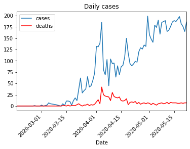

+  Comparaison aux quelque pays du tiers monde

```python
df = pd.read_csv('./datasets/countries-aggregated.csv')
df['Date'] = pd.to_datetime(df['Date'])
df = df.loc[df['Date'] > '2020-03-09']

ax = plt.gca()
df.query('Country == "Algeria"').plot(kind='line',label='Algeria', x='Date',y='Confirmed',ax=ax, marker='', color='red', linewidth=4, alpha=0.9)
df.query('Country == "Egypt"').plot(kind='line',label='Egypt',x='Date',y='Confirmed', ax=ax, marker='', color='orange', linewidth=2, alpha=0.5)
df.query('Country == "Morocco"').plot(kind='line',label='Morocco',x='Date',y='Confirmed', ax=ax, marker='', color='green', linewidth=2, alpha=0.5)
df.query('Country == "Tunisia"').plot(kind='line',label='Tunisia',x='Date',y='Confirmed', ax=ax, marker='', color='gray', linewidth=2, alpha=0.5)
df.query('Country == "Saudi Arabia"').plot(kind='line',label='Saudi Arabia',x='Date',y='Confirmed', ax=ax, marker='', color='blue', linewidth=2, alpha=0.5)
plt.title('Total cases')
plt.xticks(rotation=45)
plt.show()
```

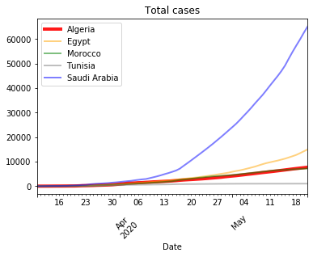

---

## Étude Approfondis

On va utiliser importer ces bibliothèques qui vont faciliter notre tache

```python
import numpy as np
import matplotlib.pyplot as plt
import pandas as pd
```

### Régression linéaire

On veut faire une régression linéaire pour essayer de prévoir le nombre de cas suspect et le nombre de décès en fonction du temps. Pour faire on doit passer par un prétraitement des données.

```python
dataset = pd.read_csv('./datasets/countries-aggregated.csv')

dataset['Date'] = pd.to_datetime(dataset['Date'])
dataset = dataset.query('Country == "Algeria"')
dataset = dataset.loc[dataset['Date'] > '2020-02-24']
dataset['Relative_Date'] = (dataset['Date'] - pd.to_datetime('2020-02-24')).dt.total_seconds() / (60 * 60 * 24)
```

On remarque des représentations graphiques de ces deux variables qu’une simple régression linéaire ne peut pas être un bonne modèle de prédiction.

```python
ax = plt.gca()
dataset.plot(kind='scatter',x='Relative_Date',y='Confirmed',ax=ax)
dataset.plot(kind='scatter',x='Relative_Date',y='Deaths', color='red', ax=ax)
plt.title('Total cases')
plt.xticks(rotation=45)
plt.show()
```

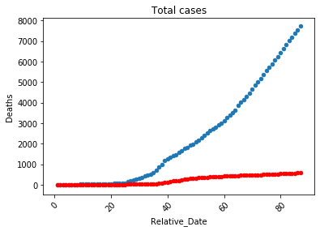

#### Modèle de prédiction du nombre de cas confirmés 

Il est possible qu'une simple transformation des données peut nous donner un graphe se rapproche plus de la linéarité par exemple on peut utiliser le `log` pour le nombre de cas (car ce graphe ressemble a une fonction exponentiel)

```python
dataset['log_confirmed'] = np.log(dataset['Confirmed'])

ax = plt.gca()
dataset.plot(kind='scatter',x='Relative_Date',y='log_confirmed',ax=ax)
plt.title('Total cases')
plt.show()
```

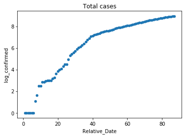

On peut remarquer que ce graphe peut être assimiler par une fonction linéaire facilement surtout après les 20 premiers jours donc on peut faire une simple régression linéaire pour ces données.

Pour faire la régression on va procéder par la méthode suivante:

+  On découpe les données en une tableau de *features* et un tableau de *labels*

```python
X = dataset.iloc[:, 5:6].values
y = dataset.iloc[:, 6].values
```

+  pour faire la validation croisé, on découpe  la data set en données de training et données de teste

Pour faire on va utiliser une classe de la bibliothèque de Machine Learning qui s’appelle `sklearn`

```python
from sklearn.model_selection import train_test_split
X_train, X_test, y_train, y_test = train_test_split(X, y, test_size = 1/4, random_state = 0)
```

+  On peut maintenant démarrer a traîner le modèle

```python
from sklearn.linear_model import LinearRegression
regressor = LinearRegression()
regressor.fit(X_train, y_train)
```

>  **Remarque**:
>
>  Cette phase peut être lente si la data set est grande

+  On peut tester notre modèle sur le teste set

```python
y_pred = regressor.predict(X_test)
```

Pour visualiser les résultats

```python
plt.scatter(X_test, (y_test), color = 'red')
plt.scatter(X_train, (regressor.predict(X_train)), color = 'blue')
plt.title('Confirmed cases in Algeria')
plt.xlabel('Days since the first case')
plt.ylabel('log cases')
plt.show()

plt.scatter(X_test, np.exp(y_test), color = 'red')
plt.scatter(X_train, np.exp(regressor.predict(X_train)), color = 'blue')
plt.title('Confirmed cases in Algeria')
plt.xlabel('Days since the first case')
plt.ylabel('log cases')
plt.show()
```

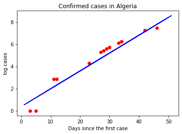

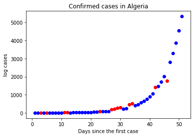

On peut accepter notre modèle car la valeur de R^2^ est très proche de 1 

```python
from sklearn.metrics import r2_score
r2_score(y_test, y_pred)
# 0.9365732056903853
```

#### Modèle de prédiction du nombre de décès

Pour le nombre de décès on  aimerai faire une régression a la base du nombre de cas et du temps, comme on peut le faire par rapport au nombre de cas confirmé seulement, et on peut aussi faire une régression du log(nombre de décès) par rapport au temps puis on peut comparer les résultats

##### A base du temps

```python
dataset['log_deaths'] = np.log(dataset['Deaths'])
dataset = dataset.replace([np.inf, -np.inf], 0)

ax = plt.gca()
dataset.plot(kind='scatter',x='Relative_Date',y='log_deaths',ax=ax)
plt.show()
```

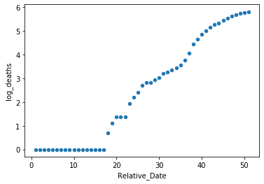

```python
X = dataset.iloc[:, 5:6].values
y = dataset.iloc[:, 7].values

from sklearn.model_selection import train_test_split
X_train, X_test, y_train, y_test = train_test_split(X, y, test_size = 1/4)

from sklearn.linear_model import LinearRegression
regressor = LinearRegression()
regressor.fit(X_train, y_train)

y_pred = regressor.predict(X_test)

plt.scatter(X_test, (y_test), color = 'red')
plt.plot(X_train, (regressor.predict(X_train)), color = 'blue')
plt.show()

plt.scatter(X_test, np.exp(y_test), color = 'red')
plt.scatter(X_train, np.exp(regressor.predict(X_train)), color = 'blue')
plt.show()
```

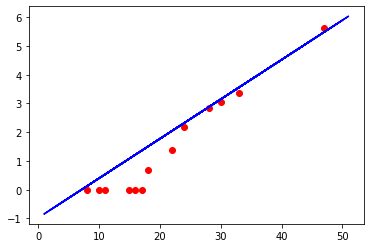

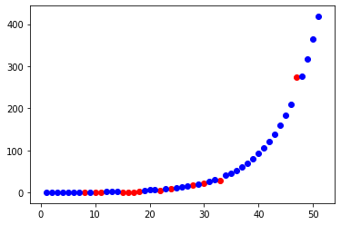

Pour la valeur de R^2^

```python
from sklearn.metrics import r2_score
r2_score(y_test, y_pred)
# 0.8438929702857934
```

##### A base du nombre de cas confirmé

```python
ax = plt.gca()
dataset.plot(kind='scatter',x='Confirmed',y='Deaths',ax=ax, color='red')
plt.show()
```

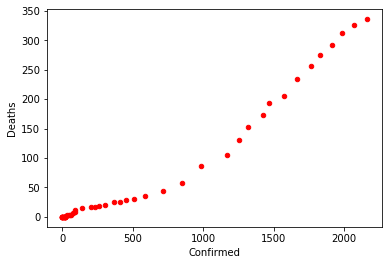

```python
X = dataset.iloc[:, 2:3].values
y = dataset.iloc[:, 4].values

from sklearn.model_selection import train_test_split
X_train, X_test, y_train, y_test = train_test_split(X, y, test_size = 1/4)

from sklearn.linear_model import LinearRegression
regressor = LinearRegression()
regressor.fit(X_train, y_train)

y_pred = regressor.predict(X_test)

plt.scatter(X_test, (y_test), color = 'red')
plt.plot(X_train, (regressor.predict(X_train)), color = 'blue')
plt.show()

from sklearn.metrics import r2_score
r2_score(y_test, y_pred)

```

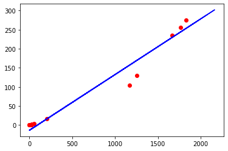

Pour la valeur de R^2^

```python
from sklearn.metrics import r2_score
r2_score(y_test, y_pred)
# 0.9587916660791518
```

Mais on peut remarquer que la qualité des prédictions a commencées de diminuer a partir de 43 eme jours

##### A base du temps et de nombre de cas confirmé

```python
X = dataset.iloc[:, [2, 5]].values
y = dataset.iloc[:, 4].values

from sklearn.model_selection import train_test_split
X_train, X_test, y_train, y_test = train_test_split(X, y, test_size = 1/4)

from sklearn.linear_model import LinearRegression
regressor = LinearRegression()
regressor.fit(X_train, y_train)

y_pred = regressor.predict(X_test)

plt.scatter(y_test, y_pred, color = 'red')
plt.show()
```

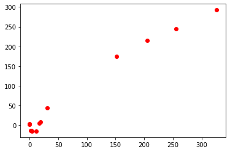

Pour R^2^

```python
from sklearn.metrics import r2_score
r2_score(y_test, y_pred)
# 0.9756190577183345
```

On remarque que le troisième modèle est le meilleur par rapport a la valeur de R^2^  

---

# Conclusion

​	Le modèle de régression reste incapable de prévoir des  résultats correct dans le future loin. En effet l’évolution de la pandémie ne dépend pas sur le temps seulement mais il y d'autres facteurs qui aident ou freinent ça propagation par exemple le degré d'application de quarantaine, le pourcentage des cas confirmés par rapport a la population total, la densité des wilayas infectés et d'autres facteurs.

​	Du toute façon pour concevoir un modèle de bonne qualité il faut une grande quantité des données de bonnes qualités, en plus il faut choisir un autre modèle car je pense que l’évolution de cette pandémie n'est pas linéaire et ne peut pas être modéliser par un modèle linéaire. 

​	On peut faire la modélisation par un algorithme *SVR* (Support Vector Regression) ou une régression polynomial ou en utilisant les arbres de décision en espérant que les résultats serons mieux adapter au contexte de cette pandémie.

---

# Bibliographie et Webographie

1. https://fr.wikipedia.org/wiki/Anaconda_(Python_distribution)
2. https://fr.wikipedia.org/wiki/Spyder_(logiciel)
3. https://fr.wikipedia.org/wiki/Scikit-learn
4. https://fr.wikipedia.org/wiki/Matplotlib
5. [Le nombre de nouvelles cas par jour](https://www.ecdc.europa.eu/en/publications-data/download-todays-data-geographic-distribution-covid-19-cases-worldwide) (en)
6. [Le nombre de cas cumulee](https://datahub.io/core/covid-19) (en)
7. [La liste détaillés des individues infectées](https://www.kaggle.com/sudalairajkumar/novel-corona-virus-2019-dataset) (en)

