<div style="text-align:center;font-size:30px">﷽</div>


<div style="text-align:center;font-size:48px">Simple statistical analysis for Covid-19 data</div>


Work done by **Mehdi CHEBBAH**.

---


# Table of Contents

[TOC]

---

# Working environment

### Anaconda

[Anaconda](https://www.anaconda.com/) is a utility for **Python** offering many features. It offers for example the possibility to **install libraries** and to use them in its programs, but also offers software to **help developers** to set up a complete development environment quickly.

### Spyder

[Spyder](https://www.spyder-ide.org/) (named Pydee in its first versions) is a **development environment** for **Python**. **Free** (MIT license) and multi-platform, it integrates many libraries for scientific use **Matplotlib**, **NumPy**, **SciPy** and **IPython**.

### Scikit-learn

[Scikit-learn](https://scikit-learn.org/stable/) is a **free** **Python** library for **machine learning**. It is developed by many contributors, especially in the academic world by French higher education and research institutes like Inria and Télécom Paris. It includes functions for estimating random forests, logistic regressions, classification algorithms, and support vector machines. It is designed to harmonize with other free Python libraries, notably **NumPy** and **SciPy**.

### Matplotlib

[Matplotlib](https://matplotlib.org/) is a **library** of the **Python** programming language for **plotting and visualizing data in graphical form**. It can be combined with the **NumPy** and **SciPy6** scientific computing python libraries. *Matplotlib* is distributed **free** and **free** under a BSD style license. Its current stable version (the 2.0.1 in 2017) is compatible with Python version 3.

---

# Study

## Statistical study

We are going to use these libraries which will facilitate our task

```python
import pandas as pd
import matplotlib.pyplot as plt
```

### Basic study

In this section we will use the data set `detailed-cases.csv` which contains data on more than **800** cases collected **between 13/01/2020 and 09/02/2020** in **China**, **Hong Kong**, **Japan**, **Singapore**, **South Korea** and other countries.

```python
df = pd.read_csv('./datasets/detailed-cases.csv')
```

we first want to estimate the age of the people likely to get sick with this pandemic. To do this

```python
boxplot = df.boxplot(column=['age'])
```

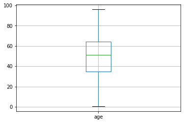

It can be seen that more than 50% of the infected are between 35 and 65 years old and that the average age is 53.  

We now want to study the effect of gender on the distribution of cases

+ in relation to the number of infections

```python
fig, ax = plt.subplots()
ax.boxplot([df.query('gender == "male"')['age'], df.query('gender == "female"')['age']])
ax.set_xticklabels(['male', 'female'])
```

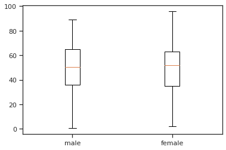

Therefore, the distribution of the infected between the two sexes in relation to age is practically equal. 

+  in relation to the number of deaths

```python
fig, ax = plt.subplots()
ax.boxplot([df.query('gender == "male" and death == "1"')['age'], df.query('gender == "female" and death == "1"')['age']])
ax.set_xticklabels(['male', 'female'])
```

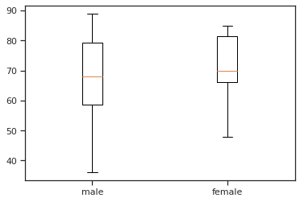

Thus, in relation to the number of deaths, more than 50% of male deaths are between 60 and 80. However, 50% of female deaths are between 67 and 82.

+  The percentage of deaths

```python
df.death.groupby(df.death).count().plot(kind='pie')
plt.axis('equal')
plt.show()
```

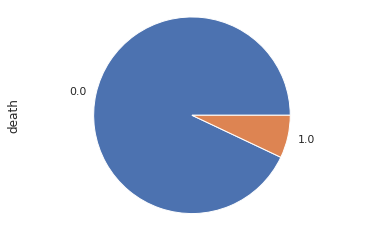

We notice that the percentage of deaths is lower than 10%.

+ Now we want to study the symptoms, and to do so we can use the word clouds.

```python
from wordcloud import WordCloud

separateur = ' '
df = df.fillna(value={'symptom': ''})
text = separateur.join(df['symptom'])
text = text.replace(",", "").strip()

word_cloud = WordCloud().generate(text)

image = word_cloud.to_image()
image.show()
```

 

So the symptoms that appear on most COVID-19 infected people are: **Fever**, **Dry cough**, **Dyspnea**, **Fatigue**, **Diarrhea**, **Sickness**, **Irritated throat**.

### The tendency of the evolution of the pandemic

For this part we will use the data set that exists in this [repo-Github](https://github.com/datasets/covid-19) that contains the data of the global cumulative evolution of COVID-19 (`world-aggregated.csv`), the cumulative evolution in each country (`countries-aggregated. csv`), a comparison between the countries most affected by this pandemic (`key-countries-pivoted.csv`) and details about the United States (`us_confirmed.csv` and `us_deaths.csv`) - we will not study the case of the United States -.

+  The evolution of the number of cases globally

We will use the data set `worldwide-aggregated.csv`.

```python
df = pd.read_csv('./datasets/worldwide-aggregate.csv')
```

for the evolution of the number of suspected cases, deaths and recovered cases

```python
ax = plt.gca()

df.plot(kind='line',x='Date',y='Confirmed',ax=ax)
df.plot(kind='line',x='Date',y='Recovered', color='red', ax=ax)
df.plot(kind='line',x='Date',y='Deaths', color='green', ax=ax)

plt.title('Total cases')
plt.xticks(rotation=45)

plt.show()
```

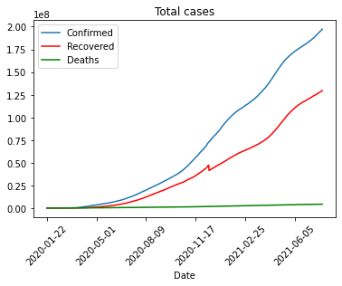

+  The rate of increase in the number of cases each day

```python
ax = plt.gca()

df.plot(kind='line',x='Date',y='Increase rate',ax=ax)

plt.title("Le taux de d'augmantation")
plt.xticks(rotation=45)

plt.show()
```

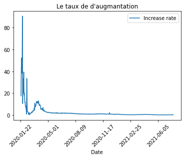

+  We now want to compare the evolution of the pandemic in the first 8 countries in the number of cases

```python
df = pd.read_csv('./datasets/key-countries-pivoted.csv')

fig, ax_lst = plt.subplots(4, 2, sharex='col', sharey='row')

for i in range(1, 9):
    ax = ax_lst.ravel()[i-1]
    ax.xaxis.get_major_locator().set_params(nbins=3)
    ax.yaxis.get_major_locator().set_params(nbins=2)
    df.plot(kind='line',x='Date',y=df.columns[i],ax=ax)

fig.tight_layout(pad=0, h_pad=.1, w_pad=.1)
```


+  A comparison between the 5 continents

```python
continents = ['Africa', 'South America', 'Europe', 'North America', 'Asia']
df = pd.read_csv('./datasets/continents-cases-deaths.csv')

fig, ax_lst = plt.subplots(3,2 , figsize=(8, 7), sharex='col', sharey='row')
fig.delaxes(ax_lst[2,1])

for i in range(5):
    ax = ax_lst.ravel()[i]
    ax.xaxis.get_major_locator().set_params(nbins=3)
    ax.yaxis.get_major_locator().set_params(nbins=2)
    ax.title.set_text(continents[i])
    df.query('Entity == "' + continents[i] + '"').plot(kind='line',x='Date',y='Total confirmed deaths (deaths)', color='red', ax=ax)
    df.query('Entity == "' + continents[i] + '"').plot(kind='line',x='Date',y='Total confirmed cases (cases)', color='blue', ax=ax)    

fig.tight_layout(pad=0, h_pad=.1, w_pad=.1)
fig.show()
```


### The evolution in Algeria

+  The evolution of the cumulative number of confirmed cases, deaths and recoveries

```python
df = pd.read_csv('./datasets/countries-aggregated.csv')
df['Date'] = pd.to_datetime(df['Date'])

ax = plt.gca()
df_algeria = df.query('Country == "Algeria"')
df_algeria.loc[df_algeria['Date'] > '2020-02-15'].plot(kind='line',x='Date',y='Confirmed',ax=ax)
df_algeria.loc[df_algeria['Date'] > '2020-02-15'].plot(kind='line',x='Date',y='Recovered', color='green', ax=ax)
df_algeria.loc[df_algeria['Date'] > '2020-02-15'].plot(kind='line',x='Date',y='Deaths', color='red', ax=ax)
plt.title('Total cases')
plt.xticks(rotation=45)
plt.show()
```

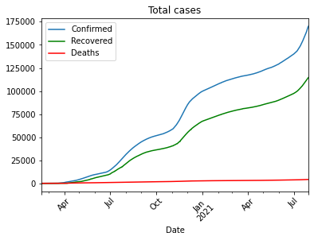

+  The evolution of the number of confirmed cases, deaths and recoveries per day

```python
df = pd.read_csv('./datasets/COVID-19-geographic-disbtribution-worldwide.csv')
df['dateRep'] = pd.to_datetime(df['dateRep'], dayfirst=True)

ax = plt.gca()
df_algeria = df.query('countriesAndTerritories == "Algeria"')
df_algeria.loc[df_algeria['dateRep'] > '2020-02-15'].plot(kind='line',x='dateRep',y='cases',ax=ax)
df_algeria.loc[df_algeria['dateRep'] > '2020-02-15'].plot(kind='line',x='dateRep',y='deaths', color='red', ax=ax)
plt.title('Daily cases')
ax.set_xlabel("Date")
plt.xticks(rotation=45)
plt.show()
```


+  Comparison to some third world countries

```python
df = pd.read_csv('./datasets/countries-aggregated.csv')
df['Date'] = pd.to_datetime(df['Date'])
df = df.loc[df['Date'] > '2020-03-09']

ax = plt.gca()
df.query('Country == "Algeria"').plot(kind='line',label='Algeria', x='Date',y='Confirmed',ax=ax, marker='', color='red', linewidth=4, alpha=0.9)
df.query('Country == "Egypt"').plot(kind='line',label='Egypt',x='Date',y='Confirmed', ax=ax, marker='', color='orange', linewidth=2, alpha=0.5)
df.query('Country == "Morocco"').plot(kind='line',label='Morocco',x='Date',y='Confirmed', ax=ax, marker='', color='green', linewidth=2, alpha=0.5)
df.query('Country == "Tunisia"').plot(kind='line',label='Tunisia',x='Date',y='Confirmed', ax=ax, marker='', color='gray', linewidth=2, alpha=0.5)
df.query('Country == "Saudi Arabia"').plot(kind='line',label='Saudi Arabia',x='Date',y='Confirmed', ax=ax, marker='', color='blue', linewidth=2, alpha=0.5)
plt.title('Total cases')
plt.xticks(rotation=45)
plt.show()
```

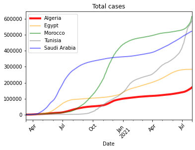

---

## In-depth study

We will be using these libraries to make our task easier

```python
import numpy as np
import matplotlib.pyplot as plt
import pandas as pd
```

### Linear regression

We want to do a linear regression to try to predict the number of suspected cases and the number of deaths as a function of time. To do this we need to go through a preprocessing of the data. 

> **Note** that it's impossible to predict the number of cases depending only on time (There are a tons of parameters that controles the spreading of the pandemic). But just for the sake of the tutorial we will do this. Because our goal is to learn how to apply a simple Machine Learning algorithm to our dataset.

```python
dataset = pd.read_csv('./datasets/countries-aggregate.csv')

dataset['Date'] = pd.to_datetime(dataset['Date'])
dataset = dataset.query('Country == "Algeria"')
dataset = dataset.loc[dataset['Date'] > '2020-02-24']
dataset['Relative_Date'] = (dataset['Date'] - pd.to_datetime('2020-02-24')).dt.total_seconds() / (60 * 60 * 24)
```

It can be seen from the graphical representations of these two variables that a simple linear regression cannot be a good prediction model.

```python
ax = plt.gca()
dataset.plot(kind='scatter',x='Relative_Date',y='Confirmed',ax=ax)
dataset.plot(kind='scatter',x='Relative_Date',y='Deaths', color='red', ax=ax)
plt.title('Total cases')
plt.xticks(rotation=45)
plt.show()
```

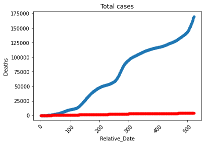


#### Model for predicting the number of deaths

We would like to do a regression based on the number of cases and time, as we can do with the number of confirmed cases only, and we can also do a regression of the number of deaths against time and compare the results

##### Time-only based

```python
ax = plt.gca()
dataset.plot(kind='scatter',x='Relative_Date',y='Deaths',ax=ax)
plt.show()
```

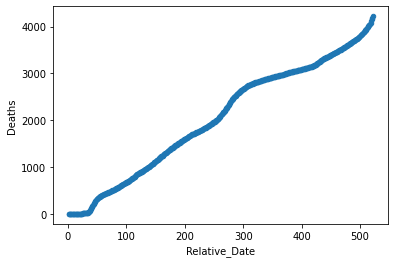

```python
X = dataset.iloc[:, 5:6].values
y = dataset.iloc[:, 4].values

from sklearn.model_selection import train_test_split
X_train, X_test, y_train, y_test = train_test_split(X, y, test_size = 1/4)

from sklearn.linear_model import LinearRegression
regressor = LinearRegression()
regressor.fit(X_train, y_train)

y_pred = regressor.predict(X_test)

plt.scatter(X_test, (y_test), color = 'red')
plt.plot(X_train, (regressor.predict(X_train)), color = 'blue')
plt.show()
```

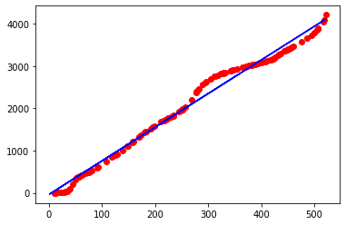

For the R^2^ value

```python
from sklearn.metrics import r2_score
r2_score(y_test, y_pred)
# 0.9878530462384223
```

##### Based on the number of confirmed cases

```python
ax = plt.gca()
dataset.plot(kind='scatter',x='Confirmed',y='Deaths',ax=ax, color='red')
plt.show()
```

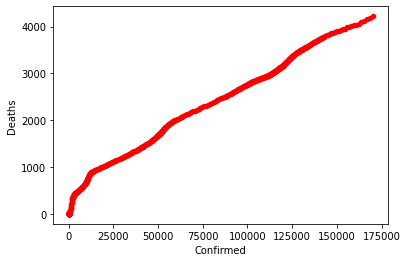

```python
X = dataset.iloc[:, 2:3].values
y = dataset.iloc[:, 4].values

from sklearn.model_selection import train_test_split
X_train, X_test, y_train, y_test = train_test_split(X, y, test_size = 1/4)

from sklearn.linear_model import LinearRegression
regressor = LinearRegression()
regressor.fit(X_train, y_train)

y_pred = regressor.predict(X_test)

plt.scatter(X_test, (y_test), color = 'red')
plt.plot(X_train, (regressor.predict(X_train)), color = 'blue')
plt.show()
```

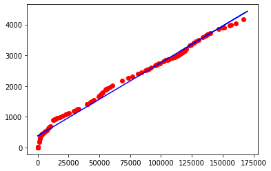

For the R^2^ value

```python
from sklearn.metrics import r2_score
r2_score(y_test, y_pred)
# 0.9869034769131676
```

##### Based on time and number of confirmed cases

```python
X = dataset.iloc[:, [2,5]].values
y = dataset.iloc[:, 4].values

from sklearn.model_selection import train_test_split
X_train, X_test, y_train, y_test = train_test_split(X, y, test_size = 1/4)

from sklearn.linear_model import LinearRegression
regressor = LinearRegression()
regressor.fit(X_train, y_train)

y_pred = regressor.predict(X_test)

plt.scatter(X_test[:,0], (y_test), color = 'red')
plt.scatter(X_train[:,0], (regressor.predict(X_train)), color = 'blue')
plt.show()
```

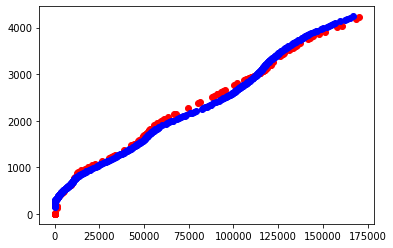

For the R^2^ value

```python
from sklearn.metrics import r2_score
r2_score(y_test, y_pred)
# 0.9920208643902232
```

We notice that the third model is the best with respect to the value of R^2^  

---

# Conclusion

The regression model is incapable of predicting correct results in the future. Indeed, the evolution of the pandemic does not depend on time only, but there are other factors that help or brake its propagation, for example the degree of quarantine application, the percentage of confirmed cases in relation to the total population, the density of infected wilayas and other factors.

However, in order to design a good quality model, a large amount of good quality data is needed. In addition, it is necessary to choose another model because I think that the evolution of this pandemic is not linear and cannot be modeled by a linear model. 

We can do the modeling by a *SVR* algorithm (Support Vector Regression) or a polynomial regression or by using decision trees hoping that the results will be better adapted to the context of this pandemic.

---

# Bibliography & Webography

1. https://fr.wikipedia.org/wiki/Anaconda_(Python_distribution) (fr)
2. https://fr.wikipedia.org/wiki/Spyder_(logiciel) (fr)
3. https://fr.wikipedia.org/wiki/Scikit-learn (fr)
4. https://fr.wikipedia.org/wiki/Matplotlib (fr)
5. [Le nombre de nouvelles cas par jour](https://www.ecdc.europa.eu/en/publications-data/download-todays-data-geographic-distribution-covid-19-cases-worldwide) (en)
6. [Le nombre de cas cumulee](https://datahub.io/core/covid-19) (en)
7. [La liste détaillés des individues infectées](https://www.kaggle.com/sudalairajkumar/novel-corona-virus-2019-dataset) (en)

